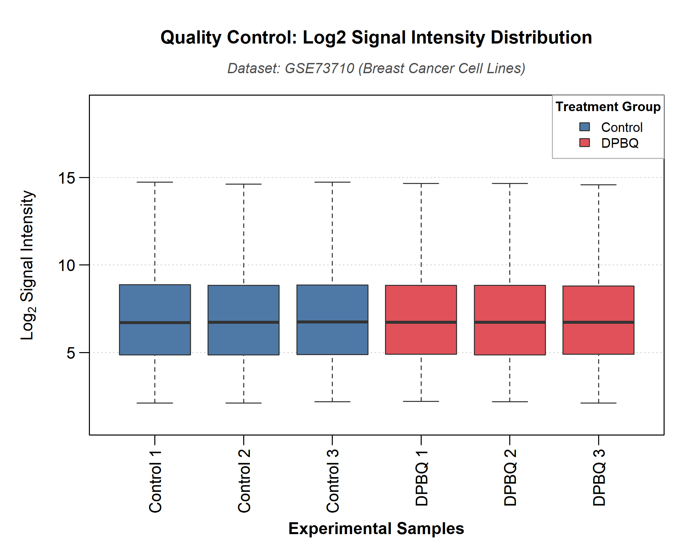
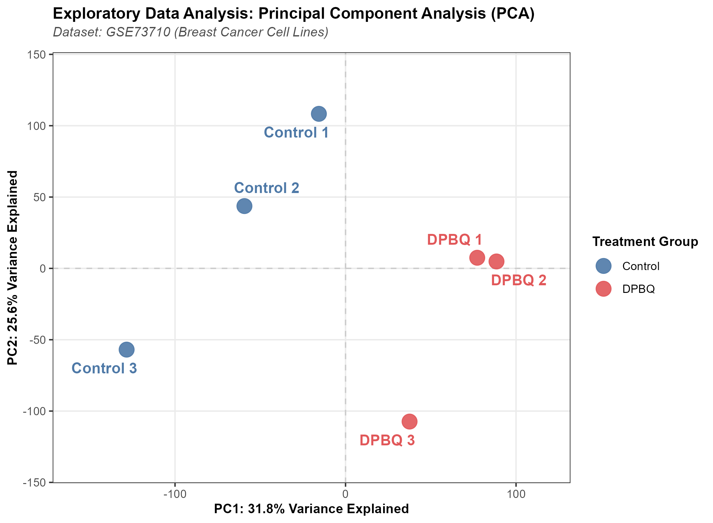
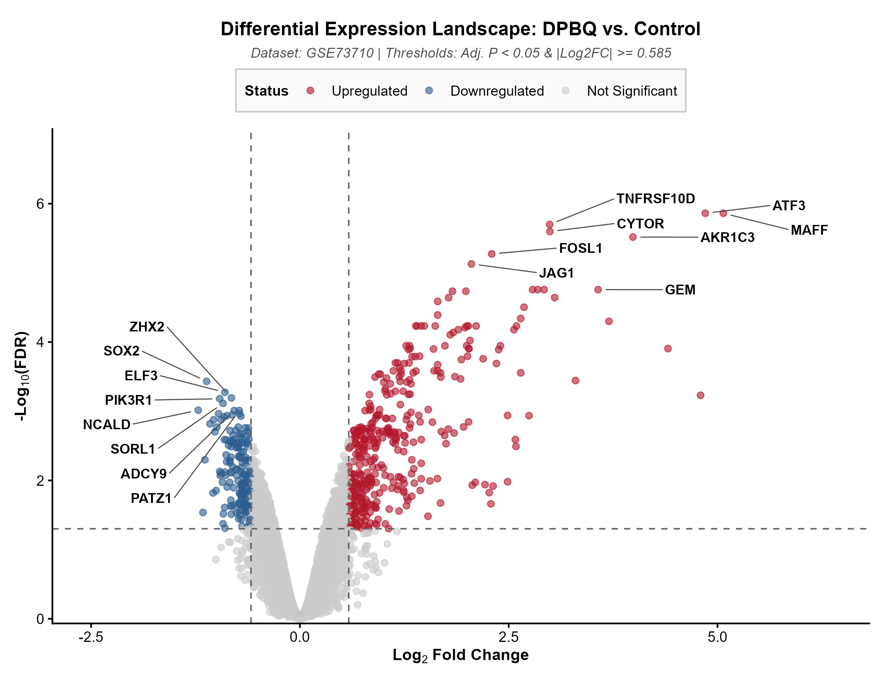
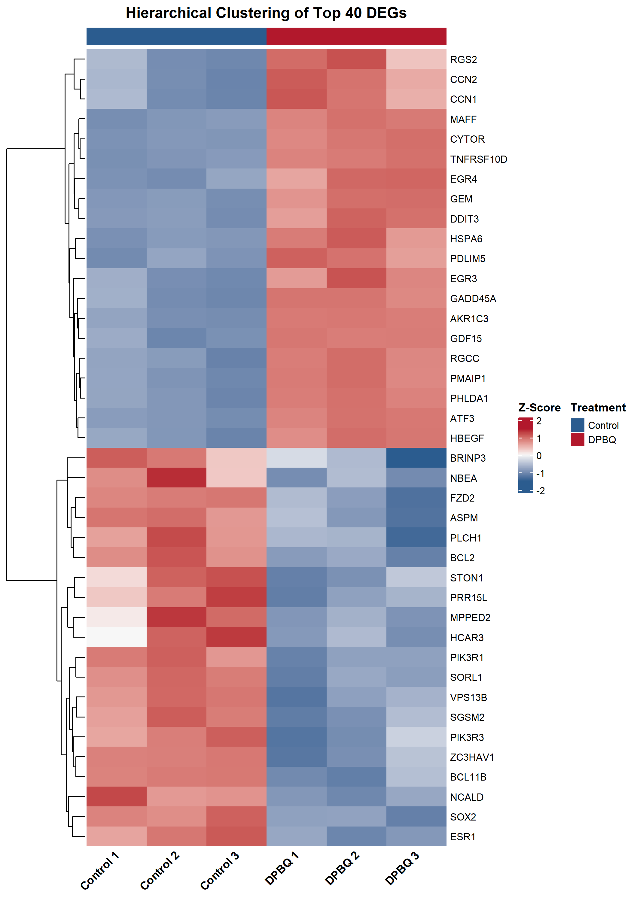
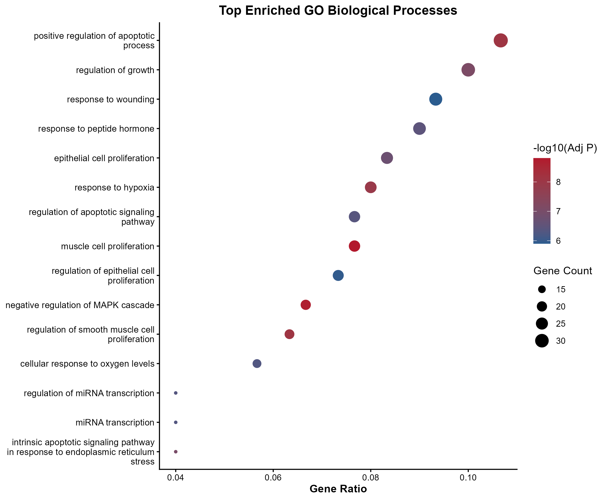
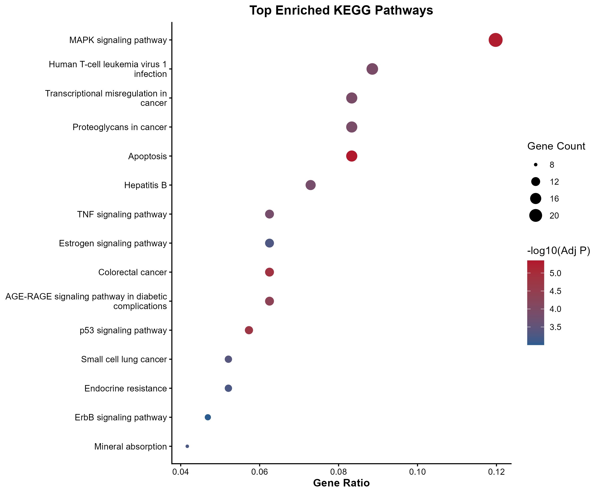
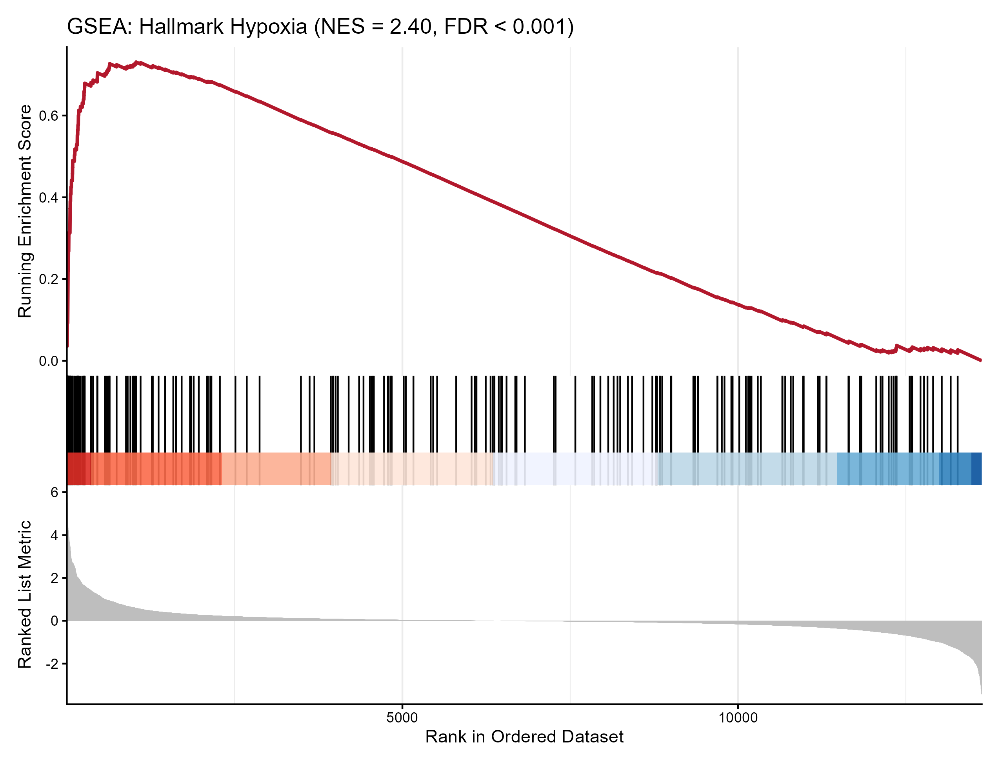
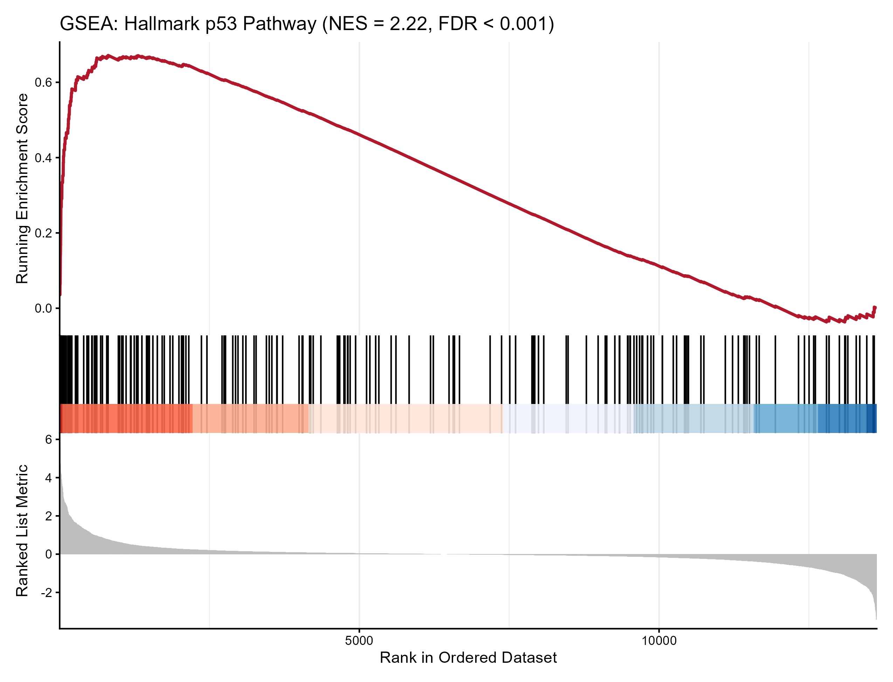

# Transcriptomic Profiling & Pathway Enrichment of DPBQ-Treated High-Ploidy Breast Cancer Models
**Introduction**
High-ploidy and polyploid breast cancers represent a clinically high-risk subgroup characterized by elevated recurrence and poor survival outcomes. This repository presents an end-to-end transcriptomic analysis pipeline evaluating the cellular impact of **DPBQ** (2,3-Diphenylbenzo[g]quinoxaline-5,10-dione)—a novel compound selectively targeting polyploid breast cancer cells. 

By re-analyzing microarray expression profiles from **NCBI GEO GSE73710**, this pipeline models differential expression landscapes, maps enriched Gene Ontology (GO) and KEGG pathways, and validates transcriptional triggers using threshold-free Gene Set Enrichment Analysis (GSEA).

---

**GEO Accession:** [GSE73710](https://www.ncbi.nlm.nih.gov/geo/query/acc.cgi?acc=GSE73710)  
**Organism:** *Homo sapiens* (MCF7 Breast Cancer Cell Line)  
**Platform:** Affymetrix Human Genome U133A 2.0 Array (`GPL571`)  
**Design:** Comparative expression profiling of MCF7 cells treated with DPBQ ($n=3$) vs. Untreated Control ($n=3$) for 6 hours.  
**Primary Citation:** Choudhary A, Zachek B, Lera RF, Zasadil LM, et al. *Identification of Selective Lead Compounds for Treatment of High-Ploidy Breast Cancer.* **Mol Cancer Ther** 2016 Jan;15(1):48-59. PMID: [26586723](https://pubmed.ncbi.nlm.nih.gov/26586723/). DOI: [10.1158/1535-7163.MCT-15-0527](https://doi.org/10.1158/1535-7163.MCT-15-0527)

### Primary Study Context
The primary study identified DPBQ as a polyploid-selective compound that triggers apoptosis without direct DNA binding or topoisomerase inhibition. Mechanistic experimentation suggested DPBQ elicits a strong **hypoxia gene signature** and enhances oxidative stress, providing a functional core structure to develop polyploid-selective oncology therapies.

---

**Objectives**

* Establish a standardized transcriptomic workflow using empirical Bayes moderation (`limma`).
* Identify statistically robust Differentially Expressed Genes (DEGs) induced by 6-hour DPBQ exposure.
* Conduct Over-Representation Analysis (ORA) across Biological Processes and signaling networks.
* Statistically validate the primary hypothesis—specifically verifying whether DPBQ induces **Hypoxia** and **p53 Pathway activation** via rank-based GSEA.

---

**Methodology & Parameters**

1. **Preprocessing:** Microarray intensity signals were background-adjusted and quantile-normalized using Robust Multi-array Average (`rma`).
2. **Differential Expression Filtering:** Evaluated using linear modeling with empirical Bayes moderation (`limma`).
   * **Strict Thresholds:** False Discovery Rate ($\text{adj.P.Val} < 0.05$) and $|\log_2\text{Fold Change}| \ge 0.585$ ($\ge 1.5\text{-fold}$).
   * **Exploratory Thresholds:** Unadjusted $P < 0.01$ and $|\log_2\text{FC}| \ge 0.585$ reserved for secondary candidate screening.
3. **Functional Enrichment:** Over-Representation Analysis performed with `clusterProfiler` against GO Biological Processes and KEGG database.
4. **Pathway Validation:** Rank-ordered GSEA performed against MSigDB Hallmark Gene Sets using the complete gene metric list ranked by $\text{sign}(\log_2\text{FC}) \times -\log_{10}(P\text{-value})$.

---

**Key Results & Figures**

**1. Data Quality Control & Normalization**

| Figure 01: Quality Control Signal Distributions | Figure 02: Principal Component Analysis (PCA) |
| :---: | :---: |
|  |  |
| **Figure 1 Legend:** Normalized $\log_2$ intensity distributions across Control ($n=3$) and DPBQ-treated ($n=3$) MCF7 replicates showing uniform medians post-RMA. | **Figure 2 Legend:** Two-dimensional PCA ordination based on top 500 variable genes. PC1 captures **57.19%** of total variance. |

* **Methodological Note on Ordination:** PC1 cleanly segregates the DPBQ treatment group from the Untreated Control group along the horizontal axis, accounting for **57.19%** of global transcriptomic variation. While biological replicates display minor within-group dispersion along PC2, treatment response represents the dominant driver of variance across the dataset.

---

**2. Differential Gene Expression**

| Figure 03: DEG Volcano Plot | Figure 04: Top DEG Heatmap |
| :---: | :---: |
|  |  |
| **Figure 3 Legend:** Volcano plot displaying DEGs ($\text{adj.P.Val} < 0.05$, $|\log_2\text{FC}| \ge 0.585$). Red: Upregulated; Blue: Downregulated. | **Figure 4 Legend:** Hierarchical clustering heatmap of top differentially expressed genes showing clear sample separation between DPBQ and Control. |

---

**3. Functional Pathway Over-Representation**

| Figure 05: Gene Ontology (BP) | Figure 06: KEGG Pathway Enrichment |
| :---: | :---: |
|  |  |
| **Figure 5 Legend:** Top enriched Gene Ontology Biological Processes highlighting cellular stress and transcriptional regulation. | **Figure 6 Legend:** Enriched KEGG signaling pathways mapped via over-representation analysis of candidate response genes. |

---

**4. Gene Set Enrichment Analysis (GSEA) Validation**

| Figure 07: Hallmark Hypoxia Pathway | Figure 08: Hallmark p53 Pathway |
| :---: | :---: |
|  |  |
| **Figure 7 Legend:** GSEA plot for MSigDB Hallmark Hypoxia pathway demonstrating strong positive enrichment ($\text{NES} = 2.43, \text{FDR} < 0.001$). | **Figure 8 Legend:** GSEA plot for MSigDB Hallmark p53 Pathway confirming robust apoptotic/p53 transcriptomic induction ($\text{NES} = 2.02, \text{FDR} < 0.001$). |

---

**Biological Interpretation & Concordance**

This independent bioinformatic re-analysis directly corroborates the core findings of Choudhary et al. (2016):

* **Induction of Hypoxic Response:** Threshold-free GSEA revealed significant enrichment of the **Hallmark Hypoxia** gene set ($\text{NES} = 2.43, \text{FDR} < 0.001$). This directly supports the primary author's mechanistic observation that DPBQ mimics hypoxia-inducible responses.
* **p53 Pathway Engagement:** GSEA confirmed strong upregulation of the **Hallmark p53 Pathway** ($\text{NES} = 2.02, \text{FDR} < 0.001$), supporting the phenotypic observation that DPBQ triggers polyploid cell death through p53-mediated apoptosis.
* **Translational Relevance:** These findings confirm that short-term (6-hour) exposure to DPBQ initiates a multi-pronged stress response (hypoxia + p53 signaling) without requiring direct genotoxic DNA damage.

---

**Reproduction & Environment Dependencies**

To run the pipeline locally:

1. Open `Breast_Cancer_GEO_Analysis.Rproj` in RStudio.
2. Execute scripts in numerical order from `Scripts/01_data_import.R` to `Scripts/06_pathway_enrichment.R`.

* **R Version:** $\ge 4.3.0$
* **Dependencies:** `limma`, `GEOquery`, `affy`, `clusterProfiler`, `org.Hs.eg.db`, `msigdbr`, `ggplot2`, `pheatmap`, `EnhancedVolcano`.
